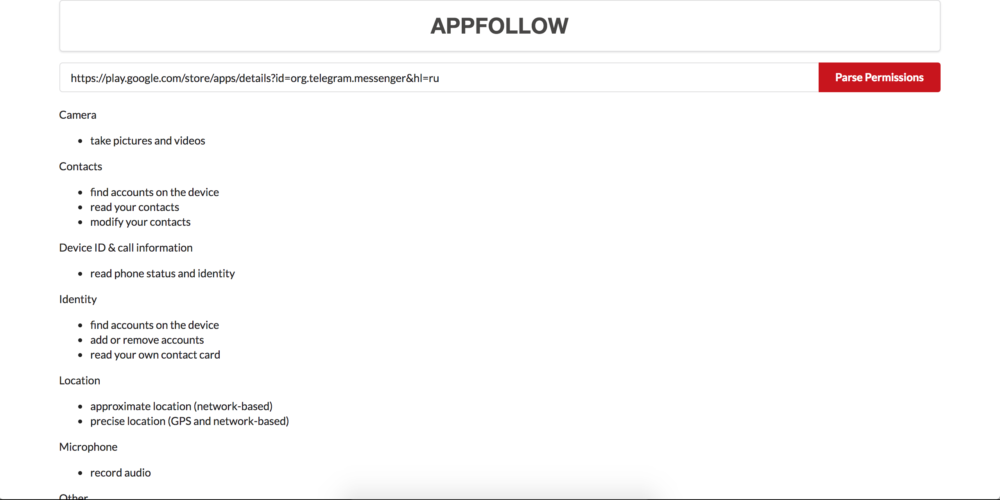

# Appfollow
Parser + Web-client for Appfollow




# Для запуска
Данная инструкция актуальна для Mac os
В случае использования другой операционной системы необходимо заменить исполняемый файл webdrivers/phantomjs на подходящий под необходимую ОС

1. Создайте базу в MySQL а так же пользователя.
```SQL
CREATE DATABASE appfollow;
CREATE USER 'appfollow'@'localhost' IDENTIFIED BY 'appfollow';
GRANT ALL PRIVILEGES ON appfollow . * TO 'appfollow'@'localhost';
FLUSH PRIVILEGES;
```
2. Создайте и активируйте виртуальное окружение с помощью virtualenv
```BASH
virtualenv --python=python3.6 Env && source Env/bin/activate
```
3. Установите зависимости
```BASH
pip install -r requirements.txt
```
4. Зайти в консоль python и выполнить следующие команды:
```python
from app import db
db.create_all()
```
5. Запустить веб приложение при желании можно запустить отдельно модуль парсинга передав ему аргументы id приложения (обязательный параметр) и язык (опционально)
```BASH
python app.py
```
